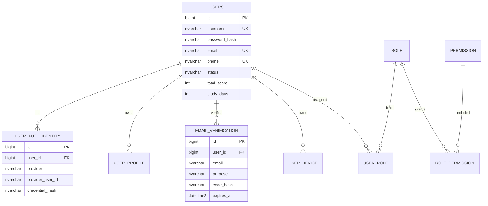
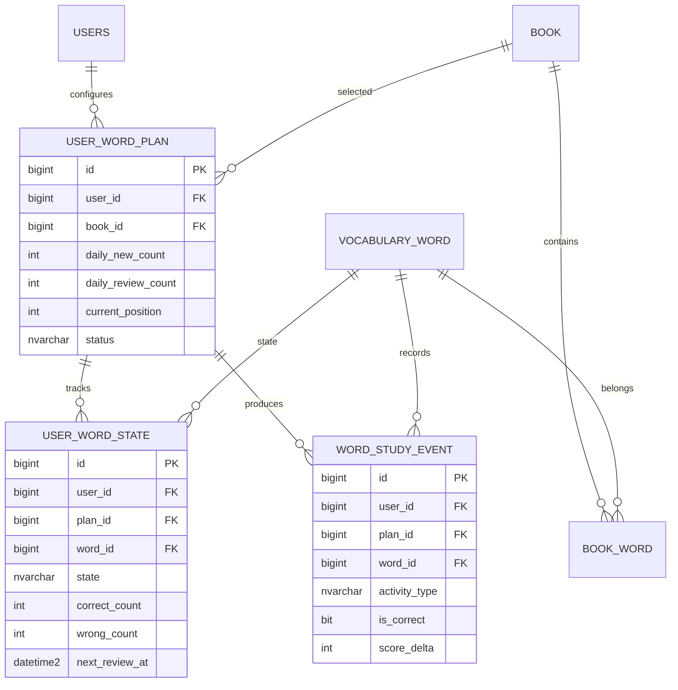
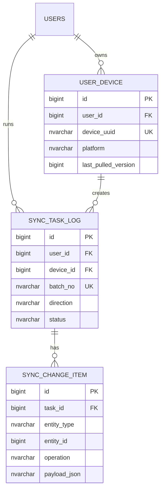

# 数据库设计

## 当前登录实现补充

- 当前正式启用的登录方式是账号密码登录：`POST /api/v1/auth/login/password`，请求体使用 `account` + `password`。
- `POST /api/v1/auth/login` 保留为兼容别名，同样走账号密码登录流程。
- `users.username` 与 `users.password_hash` 是账号密码登录的主数据；`user_auth_identity.provider = 'PASSWORD'` 用于记录当前启用的登录身份。
- QQ、微信、手机号验证码等其他登录方式暂不开放，仅通过 `user_auth_identity` 的 `provider`、`provider_user_id`、`union_id`、`credential_hash` 字段预留扩展。
- `V9__account_password_login_identity.sql` 用于为历史用户回填 `PASSWORD` 身份记录，保证迁移后已有账号也能使用直接账号密码登录。

> 版本：v2 目标设计  
> 适用范围：交互式英语自学系统服务端 SQL Server 主库、Qt 客户端 SQLite 离线库、Web/管理端数据接口。

## 1. 设计目标

本设计在现有 MVP 表结构（`users`、`vocabulary`、`study_log`、`sync_task_log`）基础上重新划分领域模型，目标是支撑以下需求：

- 用户注册、邮箱登录、预留 QQ/微信/手机号等第三方或多方式登录。
- 用户画像、学习目标、偏好、管理端角色权限；普通客户端不展示权限细节。
- 书籍/词书/题库/阅读/听说内容的统一内容管理。
- 用户上传书籍：服务端保存书籍元数据和书籍 ID，正文暂时只保存在客户端；预留服务端保存接口，并支持客户端之间分享传输。
- 单词学习计划：每日新学量、复习量、当前词书、进度、复习算法状态。
- 学习行为记录：答题、复习、阅读、听力、口语等统一事件日志。
- 错题集、收藏夹、打卡、积分、排行榜、成就系统、小组/同桌共同学习。
- 客户端离线学习与服务端最终一致同步。
- 预留标签体系、知识点关系、推荐算法和多媒体资源。

## 2. 设计原则

- **领域拆分清晰**：账号、内容、计划、学习事件、统计、同步分别建模，避免把所有字段堆到一张学习记录表。
- **事件日志不可变**：用户每次答题、复习、阅读进度提交都先写事件表，再异步或事务内更新状态表/汇总表。
- **状态表便于读取**：如 `user_word_state`、`daily_study_summary` 用于快速展示当前学习状态和图表。
- **用户内容客户端优先**：用户上传书籍、阅读、听力、口语材料时，服务端默认只保存元数据、`client_content_ref`、摘要和校验值，正文/原始文件暂时留在客户端；预留对象存储接口，并支持客户端之间分享传输。
- **同步优先设计**：所有需要离线同步的表保留 `sync_version`、`client_updated_at`、`source_device_id`、`client_event_id` 等字段。
- **扩展字段克制使用**：`ext_json` 只放低频、实验性字段；核心查询字段必须结构化。
- **兼容 SQL Server 与 SQLite**：主库使用 SQL Server 类型，客户端 SQLite 保存必要子集，通过同步接口转换。

## 3. 通用字段约定

核心业务表默认包含以下字段：

| 字段 | 类型 | 说明 |
| --- | --- | --- |
| `id` | `BIGINT IDENTITY(1,1)` | 主键 |
| `created_at` | `DATETIME2` | 创建时间 |
| `updated_at` | `DATETIME2` | 更新时间 |
| `version` | `BIGINT` | 乐观锁版本号 |
| `is_deleted` | `BIT` | 逻辑删除 |
| `ext_json` | `NVARCHAR(4000)` | 扩展信息，复杂 payload 可改 `NVARCHAR(MAX)` |
| `remark` | `NVARCHAR(500)` | 后台备注 |

需要离线同步的用户侧表额外包含：

| 字段 | 类型 | 说明 |
| --- | --- | --- |
| `sync_version` | `BIGINT` | 服务端递增同步版本 |
| `client_event_id` | `NVARCHAR(128)` | 客户端生成的幂等 ID |
| `source_device_id` | `BIGINT` | 来源设备 |
| `client_updated_at` | `DATETIME2` | 客户端修改时间 |

枚举值统一使用大写英文字符串，如 `USER`、`ADMIN`、`WORD`、`READING`、`ACTIVE`、`ARCHIVED`。

## 4. 总体 ER 图

```mermaid
erDiagram
    USERS ||--o{ USER_AUTH_IDENTITY : has
    USERS ||--o{ USER_PROFILE : owns
    USERS ||--o{ USER_DEVICE : owns
    USERS ||--o{ USER_ROLE : assigned
    ROLE ||--o{ USER_ROLE : contains
    ROLE ||--o{ ROLE_PERMISSION : grants
    PERMISSION ||--o{ ROLE_PERMISSION : included

    USERS ||--o{ BOOK : uploads
    BOOK ||--o{ BOOK_WORD : contains
    VOCABULARY_WORD ||--o{ BOOK_WORD : included
    BOOK ||--o{ BOOK_ITEM : orders
    MEDIA_ASSET ||--o{ BOOK_ITEM : referenced
    USERS ||--o{ CONTENT_SHARE : owns
    USERS ||--o{ CONTENT_SHARE : receives
    STUDY_GROUP ||--o{ CONTENT_SHARE : receives

    USERS ||--o{ USER_WORD_PLAN : configures
    BOOK ||--o{ USER_WORD_PLAN : selected
    USER_WORD_PLAN ||--o{ USER_WORD_STATE : tracks
    VOCABULARY_WORD ||--o{ USER_WORD_STATE : mastered_by
    USER_WORD_PLAN ||--o{ WORD_STUDY_EVENT : produces
    VOCABULARY_WORD ||--o{ WORD_STUDY_EVENT : answered

    QUESTION ||--o{ QUESTION_OPTION : has
    QUESTION ||--o{ QUESTION_ATTEMPT : attempted
    USERS ||--o{ QUESTION_ATTEMPT : submits
    QUESTION_ATTEMPT ||--o{ WRONG_ANSWER : creates
    USERS ||--o{ FAVORITE_ITEM : collects

    READING_PASSAGE ||--o{ READING_PROGRESS : tracked
    LISTENING_MATERIAL ||--o{ LISTENING_PROGRESS : tracked
    SPEAKING_TASK ||--o{ SPEAKING_ATTEMPT : attempted
    USERS ||--o{ READING_PROGRESS : reads
    USERS ||--o{ LISTENING_PROGRESS : listens
    USERS ||--o{ SPEAKING_ATTEMPT : speaks

    USERS ||--o{ CHECKIN_RECORD : checks_in
    USERS ||--o{ SCORE_TRANSACTION : earns
    USERS ||--o{ DAILY_STUDY_SUMMARY : summarized
    USERS ||--o{ STUDY_GROUP : creates
    STUDY_GROUP ||--o{ STUDY_GROUP_MEMBER : has
    USERS ||--o{ STUDY_GROUP_MEMBER : joins
    USERS ||--o{ STUDY_PARTNER : pairs
    USERS ||--o{ LEADERBOARD_SNAPSHOT : ranked
    STUDY_GROUP ||--o{ LEADERBOARD_SNAPSHOT : scopes
    ACHIEVEMENT ||--o{ USER_ACHIEVEMENT : awarded
    USERS ||--o{ USER_ACHIEVEMENT : receives

    TAG ||--o{ CONTENT_TAG : marks
    KNOWLEDGE_POINT ||--o{ CONTENT_KNOWLEDGE_POINT : maps
    KNOWLEDGE_POINT ||--o{ KNOWLEDGE_RELATION : parent
    KNOWLEDGE_POINT ||--o{ KNOWLEDGE_RELATION : child

    USERS ||--o{ SYNC_TASK_LOG : syncs
    USER_DEVICE ||--o{ SYNC_TASK_LOG : sends
    SYNC_TASK_LOG ||--o{ SYNC_CHANGE_ITEM : contains
```

## 5. 核心业务 ER 图

### 5.1 账号与登录

### 5.2 单词学习闭环

### 5.3 离线同步

## 6. 数据表设计

### 6.1 用户、认证与权限

| 表名 | 说明 | 关键字段 |
| --- | --- | --- |
| `users` | 用户账号主表，保留当前表名以降低迁移成本 | `username`、`password_hash`、`email`、`email_verified`、`phone`、`display_name`、`avatar_url`、`status`、`total_score`、`study_days`、`last_study_date`、`last_login_at` |
| `user_auth_identity` | 多登录方式绑定表 | `user_id`、`provider`、`provider_user_id`、`union_id`、`credential_hash`、`bound_at`、`last_login_at` |
| `user_profile` | 用户画像和学习偏好 | `user_id`、`english_level`、`target_level`、`daily_minutes`、`timezone`、`preference_json` |
| `user_device` | Qt/Web/移动端设备记录 | `user_id`、`device_uuid`、`device_name`、`platform`、`app_version`、`last_pulled_version`、`last_seen_at` |
| `role` | 角色 | `code`、`name`、`description` |
| `permission` | 权限点 | `code`、`name`、`module` |
| `user_role` | 用户角色关系 | `user_id`、`role_id` |
| `role_permission` | 角色权限关系 | `role_id`、`permission_id` |

说明：

- 角色与权限仅用于管理后台、后端鉴权和审计，普通学习客户端不展示角色/权限信息。
- 学习端只根据接口鉴权结果展示功能入口，不直接感知权限模型。

约束建议：

- `users.username` 唯一，长度 2-64。
- `users.email`、`users.phone` 可空唯一；SQL Server 下建议使用 filtered unique index：`WHERE email IS NOT NULL`。
- `user_auth_identity(provider, provider_user_id)` 唯一。
- `user_device(user_id, device_uuid)` 唯一。

### 6.2 邮箱验证与通知

| 表名 | 说明 | 关键字段 |
| --- | --- | --- |
| `email_verification` | 邮箱验证码、重置密码验证码 | `user_id`、`email`、`purpose`、`code_hash`、`send_status`、`send_count`、`expires_at`、`consumed_at` |
| `notification_message` | 系统通知、邮件/短信发送记录 | `user_id`、`channel`、`template_code`、`receiver`、`title`、`content`、`status`、`sent_at`、`error_message` |

邮箱发送接入流程：

1. 注册或绑定邮箱时写入 `email_verification`，只存验证码哈希，不保存明文验证码。
2. 调用邮件服务发送验证码，同时写 `notification_message`。
3. 用户提交验证码后校验 `code_hash`、`expires_at`、`consumed_at`。
4. 校验成功后更新 `users.email_verified = 1`，并写入 `consumed_at`。
5. 邮件服务配置建议放在环境变量：`MAIL_HOST`、`MAIL_PORT`、`MAIL_USERNAME`、`MAIL_PASSWORD`、`MAIL_FROM`。

### 6.3 书籍、词书与内容

| 表名 | 说明 | 关键字段 |
| --- | --- | --- |
| `book` | 书籍/词书/阅读材料集合的元数据 | `title`、`book_type`、`source_type`、`owner_user_id`、`language`、`level`、`cover_url`、`item_count`、`content_storage_mode`、`client_content_ref`、`content_hash`、`status` |
| `book_item` | 书籍内通用内容编排 | `book_id`、`item_type`、`item_id`、`unit_no`、`sort_order`、`title` |
| `vocabulary_word` | 单词基础库 | `word`、`normalized_word`、`phonetic_us`、`phonetic_uk`、`translation`、`part_of_speech`、`example_sentence`、`difficulty`、`audio_asset_id` |
| `book_word` | 词书与单词关系 | `book_id`、`word_id`、`unit_no`、`sort_order`、`is_required` |
| `media_asset` | 音频、视频、图片、附件元数据 | `owner_user_id`、`media_type`、`storage_provider`、`url`、`object_key`、`mime_type`、`duration_ms`、`size_bytes`、`hash`、`status` |
| `content_share` | 用户内容分享记录，支持客户端之间传输 | `owner_user_id`、`target_user_id`、`target_group_id`、`target_type`、`target_id`、`share_token`、`transfer_mode`、`expires_at`、`status` |

书籍正文存储策略：

- 系统内置词书：服务端保存 `book_word` 和 `vocabulary_word`。
- 系统阅读/听力内容：服务端保存结构化内容或对象存储链接。
- 用户上传书籍：服务端只保存 `book` 元数据、`client_content_ref`、`content_hash`；正文留在客户端本地 SQLite。
- 分享传输：用户可将本地内容分享给好友、同桌或小组成员，服务端通过 `content_share` 保存授权、有效期和分享令牌，正文传输可由客户端直传或后续对象存储中转。
- 服务端保存预留：后续需要云同步正文时，再将 `content_storage_mode` 从 `CLIENT_ONLY` 切换为 `OSS` 或 `SERVER`。

约束建议：

- `vocabulary_word.normalized_word` 建索引，便于去重与搜索。
- `book_word(book_id, word_id)` 唯一。
- `book_item(book_id, sort_order)` 建索引。
- `content_share.share_token` 唯一，分享过期后更新 `status = EXPIRED`。

### 6.4 单词计划与学习状态

| 表名 | 说明 | 关键字段 |
| --- | --- | --- |
| `user_word_plan` | 用户当前或历史单词计划 | `user_id`、`book_id`、`daily_new_count`、`daily_review_count`、`current_position`、`review_algorithm`、`started_on`、`finished_on`、`status` |
| `user_word_state` | 用户对某个单词的掌握状态 | `user_id`、`plan_id`、`book_id`、`word_id`、`state`、`first_seen_at`、`last_answered_at`、`next_review_at`、`exposure_count`、`correct_count`、`wrong_count`、`mastery_level`、`ease_factor`、`interval_days` |
| `word_study_event` | 单词学习事件流水 | `user_id`、`plan_id`、`book_id`、`word_id`、`activity_type`、`question_id`、`selected_answer`、`is_correct`、`score_delta`、`duration_ms`、`answered_at`、`client_event_id` |

单词学习记录规则：

- 每次学习/复习/答题都插入一条 `word_study_event`。
- `user_word_state` 保存最新状态，用于生成今日复习队列。
- `daily_study_summary` 保存每天聚合结果，用于首页、统计图和排行榜。
- 复习算法可先用简化 SM-2：
  - 答错：`state = LEARNING`，`wrong_count + 1`，`next_review_at` 推迟到当天稍后。
  - 答对：`correct_count + 1`，提升 `mastery_level`，增加 `interval_days`。
  - 连续掌握后：`state = MASTERED`，下次复习间隔加长。

关键唯一约束：

- `user_word_plan(user_id, book_id, status)` 可限制同一用户同一词书只有一个 `ACTIVE` 计划。
- `user_word_state(user_id, plan_id, word_id)` 唯一。
- `word_study_event(user_id, client_event_id)` 唯一，保证离线上传幂等。

### 6.5 题库、答题、错题与收藏

| 表名 | 说明 | 关键字段 |
| --- | --- | --- |
| `question` | 统一题库 | `module_type`、`question_type`、`source_type`、`source_id`、`stem`、`answer_text`、`explanation`、`difficulty`、`media_asset_id`、`status` |
| `question_option` | 选择题选项 | `question_id`、`option_key`、`option_text`、`is_correct`、`sort_order` |
| `question_attempt` | 用户答题记录 | `user_id`、`question_id`、`module_type`、`selected_option_id`、`answer_payload_json`、`is_correct`、`score_delta`、`duration_ms`、`answered_at`、`client_event_id` |
| `wrong_answer` | 错题集 | `user_id`、`question_id`、`module_type`、`first_wrong_at`、`last_wrong_at`、`wrong_count`、`resolved_at`、`status` |
| `favorite_item` | 收藏夹 | `user_id`、`target_type`、`target_id`、`folder_name`、`favorited_at` |

说明：

- 当前 `vocabulary.option1/2/3` 的做法只适合 MVP。目标设计中，选项迁移到 `question_option`。
- 单词题可以由 `vocabulary_word` 自动生成，也可以落库为 `question`。
- `wrong_answer` 从 `question_attempt` 派生，用户答对复习题后可标记 `RESOLVED`。

### 6.6 阅读理解模块

| 表名 | 说明 | 关键字段 |
| --- | --- | --- |
| `reading_passage` | 阅读文章 | `book_id`、`owner_user_id`、`source_type`、`title`、`content`、`summary`、`language`、`level`、`word_count`、`estimated_minutes`、`content_storage_mode`、`client_content_ref`、`content_hash`、`status` |
| `reading_progress` | 用户阅读进度 | `user_id`、`passage_id`、`progress_percent`、`last_position`、`read_seconds`、`completed_at`、`last_read_at`、`client_event_id` |

阅读理解题仍放在 `question`，通过 `question.source_type = READING_PASSAGE`、`question.source_id = reading_passage.id` 关联。

内容来源规则：

- 管理后台统一录入的阅读内容，`source_type = SYSTEM`，正文可保存在服务端结构化字段或对象存储。
- 用户自行导入的阅读材料，`source_type = USER_UPLOAD`，处理策略同用户上传书籍：服务端保存元数据和引用，正文默认留在客户端，并可通过 `content_share` 分享。

### 6.7 听力与口语模块

| 表名 | 说明 | 关键字段 |
| --- | --- | --- |
| `listening_material` | 听力材料 | `book_id`、`owner_user_id`、`source_type`、`title`、`transcript`、`media_asset_id`、`level`、`duration_ms`、`content_storage_mode`、`client_content_ref`、`content_hash`、`status` |
| `listening_progress` | 听力学习进度 | `user_id`、`material_id`、`listen_seconds`、`completed_count`、`last_position_ms`、`last_listened_at`、`client_event_id` |
| `speaking_task` | 口语任务 | `owner_user_id`、`source_type`、`title`、`prompt_text`、`reference_text`、`media_asset_id`、`level`、`score_config_json`、`content_storage_mode`、`client_content_ref`、`status` |
| `speaking_attempt` | 口语作答/评测记录 | `user_id`、`task_id`、`audio_asset_id`、`evaluation_mode`、`evaluation_provider`、`recognized_text`、`score_total`、`score_detail_json`、`duration_ms`、`attempted_at`、`client_event_id` |

听力和口语内容来源规则：

- 管理后台可统一录入系统听力材料和口语任务。
- 用户也可以从客户端导入本地材料，服务端默认只保存元数据、哈希和本地引用，正文/音频处理同上传书籍。
- 用户上传材料可通过 `content_share` 分享给好友、同桌或小组成员。

语音评测规则：

- 暂时只预留接口，不强制用户录音上传服务端。
- `evaluation_mode` 可取 `LOCAL`、`SERVER`、`THIRD_PARTY`：本地直接评测时只上传分数和结果摘要；服务端/第三方评测时可上传或引用 `audio_asset_id`。
- 第三方语音评测 SDK 后续接入时，把评测结果结构化存入 `speaking_attempt.score_detail_json`，必要指标再提升为结构化字段。

### 6.8 激励、统计与排行榜

| 表名 | 说明 | 关键字段 |
| --- | --- | --- |
| `score_transaction` | 积分流水 | `user_id`、`source_type`、`source_id`、`score_delta`、`balance_after`、`reason` |
| `daily_study_summary` | 用户每日学习汇总 | `user_id`、`study_date`、`new_words`、`review_words`、`correct_count`、`wrong_count`、`study_seconds`、`score_delta`、`completed_tasks` |
| `checkin_record` | 每日打卡 | `user_id`、`checkin_date`、`streak_days`、`reward_score`、`source` |
| `achievement` | 成就定义 | `code`、`name`、`description`、`condition_json`、`reward_score`、`status` |
| `user_achievement` | 用户已获得成就 | `user_id`、`achievement_id`、`achieved_at`、`progress_json` |
| `study_group` | 学习小组，可由用户自建 | `owner_user_id`、`name`、`description`、`join_mode`、`invite_code`、`status` |
| `study_group_member` | 小组成员 | `group_id`、`user_id`、`member_role`、`joined_at`、`status` |
| `study_partner` | 同桌/好友学习关系 | `user_id`、`partner_user_id`、`relation_type`、`status`、`created_at` |
| `leaderboard_snapshot` | 排行榜快照 | `scope_type`、`scope_id`、`period_type`、`period_start`、`period_end`、`rank_date`、`user_id`、`rank_no`、`score` |

说明：

- 排行榜范围包括全站榜、词书榜、小组榜、好友/同桌榜，以及日榜、周榜、月榜、总榜。
- 各类榜单都需要在后台存储快照，`scope_type` 可取 `GLOBAL`、`BOOK`、`GROUP`、`FRIEND`，`period_type` 可取 `DAY`、`WEEK`、`MONTH`、`ALL_TIME`。
- 小规模实时榜可直接按 `users.total_score` 或聚合表查询；正式榜单以 `leaderboard_snapshot` 为准，避免每次全表排序。
- `users.total_score` 是冗余字段，权威来源是 `score_transaction`。
- 用户可自建小组，也可以建立同桌/好友关系，用于朋友间共同学习、互相排行和打卡激励。

### 6.9 标签、知识点与推荐预留

| 表名 | 说明 | 关键字段 |
| --- | --- | --- |
| `tag` | 标签字典 | `name`、`tag_type`、`description` |
| `content_tag` | 内容标签关系 | `target_type`、`target_id`、`tag_id` |
| `knowledge_point` | 知识点 | `code`、`name`、`description`、`level` |
| `content_knowledge_point` | 内容与知识点关系 | `target_type`、`target_id`、`knowledge_point_id`、`weight` |
| `knowledge_relation` | 知识点关系图 | `parent_id`、`child_id`、`relation_type`、`weight` |
| `recommendation_log` | 推荐结果记录 | `user_id`、`target_type`、`target_id`、`reason_code`、`score`、`shown_at`、`clicked_at` |

说明：

- `target_type + target_id` 是多态关联，数据库层不强制外键，由服务层校验。
- 推荐算法可以先基于错题、掌握度、标签和难度生成，后续再替换为独立推荐服务。

### 6.10 离线同步

| 表名 | 说明 | 关键字段 |
| --- | --- | --- |
| `sync_task_log` | 同步批次日志，保留现有表并扩展 | `user_id`、`device_id`、`batch_no`、`direction`、`task_type`、`status`、`request_payload_json`、`response_payload_json`、`error_message`、`started_at`、`finished_at` |
| `sync_change_item` | 批次内每条实体变更 | `task_id`、`entity_type`、`entity_id`、`client_entity_id`、`operation`、`payload_json`、`result_status`、`error_message` |
| `server_change_log` | 服务端增量下发日志，可选 | `sync_version`、`entity_type`、`entity_id`、`operation`、`changed_at` |

同步规则：

- 客户端上传时必须带 `device_uuid`、`client_event_id` 和 `client_updated_at`。
- 服务端以 `user_id + client_event_id` 做幂等去重。
- 普通学习记录冲突采用“最后修改时间优先”；账号、安全、权限类数据采用“服务端优先”。
- 客户端拉取时使用 `user_device.last_pulled_version` 获取增量。
- 删除操作统一写逻辑删除，并同步 `is_deleted = 1`。

### 6.11 系统管理与审计

| 表名 | 说明 | 关键字段 |
| --- | --- | --- |
| `audit_log` | 后台操作审计 | `operator_user_id`、`action`、`target_type`、`target_id`、`ip_address`、`user_agent`、`detail_json` |
| `system_config` | 系统配置 | `config_key`、`config_value`、`value_type`、`description`、`is_sensitive` |
| `import_task` | 内容导入任务 | `operator_user_id`、`task_type`、`source_file_asset_id`、`status`、`total_count`、`success_count`、`failed_count`、`error_report_json` |

## 7. 当前 MVP 表迁移建议

现有 Flyway：

- `V1__init_schema.sql`：`users`、`vocabulary`、`study_log`、`sync_task_log`
- `V2__seed_vocabulary.sql`：测试词汇

建议后续迁移顺序：

| 迁移脚本 | 目的 |
| --- | --- |
| `V3__expand_user_auth.sql` | 给 `users` 增加邮箱、手机号、状态、头像等字段；创建 `user_auth_identity`、`user_profile`、`user_device`、角色权限表 |
| `V4__content_book_schema.sql` | 创建 `book`、`book_item`、`vocabulary_word`、`book_word`、`media_asset`；迁移 `vocabulary` 数据 |
| `V5__word_learning_schema.sql` | 创建 `user_word_plan`、`user_word_state`、`word_study_event`；将 `study_log` 作为历史兼容表或迁移到事件表 |
| `V6__question_bank_schema.sql` | 创建 `question`、`question_option`、`question_attempt`、`wrong_answer`、`favorite_item` |
| `V7__extended_learning_and_share_schema.sql` | 创建内容分享、阅读、听力、口语相关表，支持后台统一录入、客户端本地导入和客户端之间分享传输 |
| `V8__community_leaderboard_schema.sql` | 创建小组/同桌、打卡、成就和多范围排行榜快照表 |
| `V9__account_password_login_identity.sql` | 为历史用户回填 `PASSWORD` 登录身份，明确账号密码登录为当前正式登录方式 |
| `V10__admin_tag_knowledge_schema.sql` | 创建管理、标签、知识点和推荐预留表 |

兼容策略：

- `users` 保留表名，避免认证代码大改。
- `vocabulary` 可先保留为兼容视图或临时表，再迁移到 `vocabulary_word`。
- `study_log` 的字段映射到 `word_study_event`：`word_id`、`selected_answer`、`is_correct`、`score_delta`、`answered_at`。
- 当前排行榜仍可读 `users.total_score`，后续由 `score_transaction` 汇总维护，并写入不同范围和周期的 `leaderboard_snapshot`。

## 8. 索引建议

| 表名 | 索引 |
| --- | --- |
| `users` | `uk_users_username`、`uk_users_email_not_null`、`idx_users_score`、`idx_users_status` |
| `user_auth_identity` | `uk_auth_provider_user`、`idx_auth_user` |
| `book` | `idx_book_type_status`、`idx_book_owner`、`idx_book_title` |
| `content_share` | `uk_content_share_token`、`idx_content_share_target`、`idx_content_share_owner` |
| `vocabulary_word` | `idx_word_normalized`、`idx_word_difficulty` |
| `book_word` | `uk_book_word`、`idx_book_word_order` |
| `user_word_plan` | `idx_word_plan_user_status`、`idx_word_plan_book` |
| `user_word_state` | `uk_user_plan_word`、`idx_word_state_due`、`idx_word_state_user_state` |
| `word_study_event` | `uk_word_event_client`、`idx_word_event_user_time`、`idx_word_event_word` |
| `question_attempt` | `uk_question_attempt_client`、`idx_question_attempt_user_time`、`idx_question_attempt_question` |
| `daily_study_summary` | `uk_daily_user_date` |
| `checkin_record` | `uk_checkin_user_date` |
| `study_group` | `idx_study_group_invite_code`、`idx_study_group_owner` |
| `study_group_member` | `uk_group_member`、`idx_group_member_user` |
| `study_partner` | `uk_study_partner_pair`、`idx_study_partner_user` |
| `leaderboard_snapshot` | `idx_leaderboard_scope_period`、`idx_leaderboard_user` |
| `sync_task_log` | `uk_sync_batch_no`、`idx_sync_user_device_time` |
| `server_change_log` | `idx_server_change_version` |

## 9. 客户端 SQLite 子集

Qt 客户端本地库不需要保存全部后台表，建议保存以下子集：

- `local_user_profile`：当前登录用户基础信息。
- `local_book`：用户可用书籍元数据，包括本地上传书籍。
- `local_book_content`：用户上传书籍正文或解析后的本地结构。
- `local_content_share`：本地内容分享授权、接收记录和传输状态。
- `local_vocabulary_word`、`local_book_word`：词书内容缓存。
- `local_user_word_plan`、`local_user_word_state`：离线计划和复习队列。
- `local_word_study_event`、`local_question_attempt`：离线学习事件，等待上传。
- `local_sync_outbox`：待同步变更队列。
- `local_transfer_outbox`：等待与其他客户端分享传输的内容包。
- `local_sync_meta`：最后同步版本、设备 ID、登录态摘要。

本地表需要保留 `local_id` 和 `server_id`：

- `local_id`：SQLite 自增主键，离线创建时立即可用。
- `server_id`：同步成功后由服务端返回。
- `client_event_id`：上传幂等 ID，重试时保持不变。

## 10. 已确认问题与设计决策

| 问题 | 结论 | 设计影响 |
| --- | --- | --- |
| 用户上传书籍正文是否长期只保存在客户端，还是后续允许同步到对象存储 | 暂时仅保存在客户端；预留保存到服务端/对象存储接口；允许客户端之间分享传输 | `book.content_storage_mode` 默认 `CLIENT_ONLY`，用 `client_content_ref` 和 `content_hash` 定位本地内容；新增 `content_share` 记录分享授权和传输状态 |
| 阅读、听力、口语内容是否由管理后台统一录入，还是允许客户端导入本地材料 | 系统内容由管理后台统一录入；用户也可自行上传/导入，本地内容处理同书籍 | 阅读、听力、口语内容表增加 `source_type`、`owner_user_id`、`content_storage_mode`、`client_content_ref`、`content_hash` |
| 排行榜范围是否只有全站总榜，还是需要词书榜、班级榜、周榜/月榜 | 全站榜、词书榜、小组榜、好友/同桌榜、日榜、周榜、月榜、总榜都需要后台存储；支持自建小组和同桌关系 | 增加 `study_group`、`study_group_member`、`study_partner`；`leaderboard_snapshot` 使用 `scope_type` 和 `period_type` 表达不同榜单 |
| 普通客户端是否需要展示角色/权限信息，还是仅管理端使用 | 仅管理员可见 | `role`、`permission`、`user_role`、`role_permission` 只服务管理后台、后端鉴权和审计，普通学习端不展示 |
| 语音评测接入后，用户录音是否必须上传服务端 | 暂时只预留接口；可本地评测，也可后续改为服务端/第三方评测 | `speaking_attempt.evaluation_mode` 区分 `LOCAL`、`SERVER`、`THIRD_PARTY`；本地评测只上传结果摘要，服务端评测再上传或引用 `audio_asset_id` |
